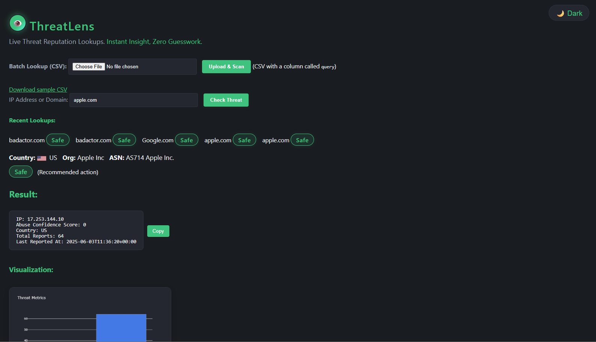

# ThreatLens
*Created by Teshera Kimbrough*

---

## 🚀 What is ThreatLens?

**ThreatLens** is a modern, user-friendly Threat Intelligence Dashboard for instant IP and domain reputation lookups.  
Built to empower security teams, IT professionals, and AI/data engineers with actionable threat intelligence—no guesswork.

---

## 🌟 Features

- **Single & Batch Lookups:** Instantly check single IP/domain or upload a CSV for fast batch scanning.
- **Enterprise-Grade Insights:** Reputation, abuse confidence score, country (with flag), org, ASN, verdict, and action.
- **Recent Lookups:** See your latest checks at a glance.
- **Actionable Verdicts:** "Safe", "Risky", or "Malicious"—plus clear next steps.
- **Pluggable Alerts:** Easily connect with Slack, Teams, or Google Chat via webhooks.
- **Copy & Export:** One-click copy for incident response, batch CSV export for workflow integration.
- **Modern UX:** Light/dark mode, accessible, responsive, and beautiful.
- **Ready for the Real World:** Deploy anywhere. No secrets in code. Built for analysts, not just devs.

---

## 💡 Why ThreatLens? (Real-World Impact)

- **SOC & Incident Response:** Save hours vs. manual copy-paste or “Googling” IPs. Get instant context and next steps.
- **IT/Cloud Providers:** Scan logs, blocklists, or user reports—see what’s safe and what needs action.
- **AI & Data Engineering:** Integrate threat intelligence into data pipelines or AI models.
- **Your Portfolio:** Showcases Python, Flask, APIs, security best practices, real UI polish, and user empathy.

---

## 📢 New in this version → Multilingual UI support 🌍

ThreatLens (Streamlit) now supports **automatic translation of result text** into multiple languages:

✅ English  
✅ Spanish  
✅ French  
✅ German  
✅ Japanese  
✅ Chinese (Simplified)

👉 Users can select their language via dropdown → results will be translated automatically.  
👉 This makes ThreatLens more accessible for **global security teams and international users**.

---

## 📸 Screenshots



---

## ⚡ Quick Start

```bash
git clone https://github.com/tesherak/threatlens.git
cd threatlens
python -m venv .venv
source .venv/bin/activate   # Or: .venv\Scripts\activate (Windows)
pip install -r requirements.txt
# Add your AbuseIPDB API key as an environment variable or in main.py
python main.py

```

Go to http://127.0.0.1:5000/ and explore!

---

## 📂 Batch Mode

- **Prepare a CSV file** with a column named `query` containing IPs/domains.
- **Upload via the dashboard.**
- **See instant results** (verdict, country, org, etc.) for each entry.

---

## 🏗 Architecture

- **Backend:** Python Flask, requests, Plotly
- **Frontend:** HTML, CSS (dark/light mode), vanilla JS
- **Threat Intel:** AbuseIPDB API

---

## 🌐 Deployment

- Runs anywhere (Railway, Render, Heroku, AWS, GCP, etc.)
- API key via environment variable for security.

---

## 🧩 Pluggable Alerts

- Easily connect to Slack, Teams, or Google Chat with your webhook.
- See /utils/alerts.py for example code.
- Add your webhook URLs as environment variables (SLACK_WEBHOOK_URL, TEAMS_WEBHOOK_URL, GOOGLE_CHAT_WEBHOOK_URL).

---

## 🔐 Security & Privacy

- No lookups are stored server-side.
- All data handled in-memory for current session only.
- API keys are never hard-coded—use environment variables.

---

## 🛠 Extending ThreatLens

- Batch CSV export for integration.
- Custom alerting (plug in your chat or SIEM).
- Cloud/SIEM-ready for Splunk, ELK, etc.

---

## ✨ Personal Note: 
I built this project not just to show my technical skills (Python, Flask, APIs, front-end, security), but to prove that I can deliver real solutions to real-world problems quickly, efficiently, and with empathy for the end user.

---

## 🎯 My Goal

To join a team at the forefront of security or AI, where I can turn challenges into impact.

---

## 🧑‍💻 About the Author

**Teshera Kimbrough**  
[LinkedIn](https://www.linkedin.com/in/tesherakimbrough)  
Security & AI Engineering | Modern IT Solutions 

---

## 📢 Hire Me
I’m actively looking for my next role!
If you’re hiring in security, cloud, or AI engineering,
please connect on LinkedIn
or email me: teshera.kimbrough@gmail.com.

---

## License

MIT License

---
